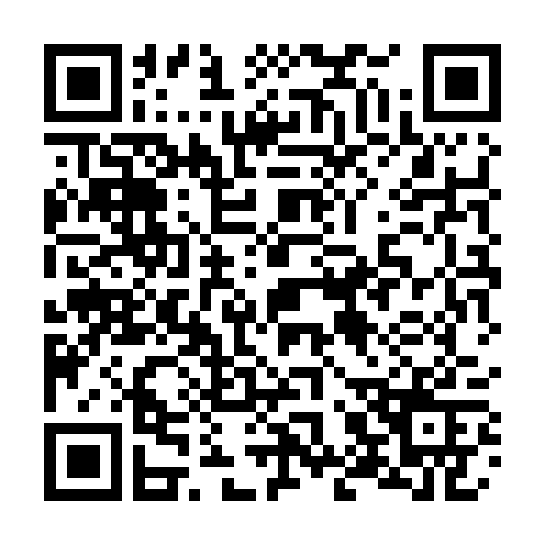

# 🏦 PIX QR Code Generator


> 🚀 Gere QR Codes PIX válidos e prontos para uso em segundos — direto do seu código, linha de comando ou através de uma interface web moderna.

**Perfeito para:**
- 💼 Desenvolvedores que precisam integrar pagamentos PIX
- 🏪 Empreendedores criando soluções de cobrança
- 🔧 Automação de processos financeiros
- 📱 Aplicações que necessitam de QR Codes dinâmicos

**Diferenciais:**
- ✅ Interface web intuitiva com Streamlit
- ✅ Geração de PNG e SVG em alta qualidade
- ✅ Suporte a valores fixos ou livres
- ✅ CLI completa para automações
- ✅ Validação automática de chaves PIX
- ✅ Controle de tamanho do QR Code
- ✅ 100% compatível com o padrão BR Code do Banco Central

---

## 💻 Pré-requisitos

Antes de começar, verifique se você possui:

- Python **3.9+** instalado  
- `pip` atualizado  
- Sistema operacional: **Windows**, **Linux** ou **macOS**

---

## 🚀 Instalando PIX QR Generator

### Instalação via pip (Recomendado)

```bash
pip install -e .
```

### Ou clone o repositório

```bash
git clone https://github.com/jeancarloscc/qrcodepix.git
cd qrcodepix
pip install -r requirements.txt
```

### Dependências

O projeto utiliza as seguintes bibliotecas principais:

- **Streamlit** - Interface web moderna e interativa
- **Segno** - Geração de QR Codes (PNG e SVG)
- **Pillow** - Processamento de imagens (fallback)

Para instalar todas as dependências:

```bash
pip install streamlit segno pillow
```

---

## ☕ Usando o projeto

### 🌐 Interface Web com Streamlit (Recomendado)

A forma mais fácil e intuitiva de usar o projeto:

```bash
streamlit run src/webapp/app_streamlit.py
```

Acesse no navegador: � [http://localhost:8501](http://localhost:8501)

**Recursos da interface:**
- ✅ Seleção de tipo de chave PIX (Email, Telefone, CPF/CNPJ, Chave Aleatória)
- ✅ Exemplos dinâmicos para cada tipo de chave
- ✅ Controle de tamanho do QR Code (escala de 5 a 20)
- ✅ Geração simultânea de PNG e SVG
- ✅ Download individual ou em arquivo ZIP
- ✅ Validação automática de campos
- ✅ QR Codes com ou sem valor definido

---

### �🔹 Linha de comando (CLI)

Gerar um QR Code com valor fixo:

```bash
python -m qrcodepix.cli.main --key seuemail@exemplo.com --name "João Silva" --city "Sao Paulo" --amount 10.00 --txid ABC123 --out meu_pix
```

Gerar um QR Code **sem valor definido** (pagador escolhe o valor):

```bash
python -m qrcodepix.cli.main --key seuemail@exemplo.com --name "João Silva" --city "Sao Paulo" --out pix_sem_valor
```

Adicionar descrição opcional:

```bash
python -m qrcodepix.cli.main --key +5511987654321 --name "Maria Santos" --city "Rio de Janeiro" --amount 25.50 --desc "Pagamento de serviço" --out pix_servico
```

Os arquivos serão salvos como:

```
./meu_pix.png
./meu_pix.svg
```

---

### � Usando como biblioteca Python

```python
from qrcodepix.core.payload import build_pix_payload
from qrcodepix.generator.qr import save_qr_files

# Gerar o payload PIX
payload = build_pix_payload(
    chave_pix="seuemail@exemplo.com",
    merchant_name="João Silva",
    merchant_city="Sao Paulo",
    valor=10.50,  # Opcional - None para valor livre
    txid="REF123",  # Opcional
    description="Pagamento"  # Opcional
)

# Gerar os arquivos QR Code
png_path, svg_path = save_qr_files(
    payload, 
    filename_base="meu_qrcode",
    scale=10,  # Tamanho (5-20)
    border=4   # Borda
)

print(f"Arquivos gerados: {png_path}, {svg_path}")
```

---

## ✨ Funcionalidades

- 🎯 **Tipos de Chave PIX Suportados:**
  - 📧 Email
  - 📱 Telefone (com +55 ou DDD)
  - 🆔 CPF/CNPJ (com ou sem formatação)
  - 🔑 Chave Aleatória (EVP/UUID)

- 💰 **Opções de Pagamento:**
  - Valor fixo definido
  - Valor livre (pagador escolhe)

- 🎨 **Formatos de Saída:**
  - PNG em alta resolução
  - SVG vetorial (ideal para impressão)
  - Download em ZIP (ambos os formatos)

- 🔧 **Configurações Avançadas:**
  - Controle de tamanho (scale 5-20)
  - TXID personalizado
  - Descrição opcional
  - Bordas ajustáveis

---

## 📫 Contribuindo

Para contribuir com **PIX QR Generator**:

1. Faça um fork do repositório
2. Crie uma branch:

   ```bash
   git checkout -b feature/nova-funcionalidade
   ```
3. Faça suas alterações e commit:

   ```bash
   git commit -m "Adiciona nova funcionalidade"
   ```
4. Envie para o repositório remoto:

   ```bash
   git push origin feature/nova-funcionalidade
   ```
5. Abra um **Pull Request**.

---

## 🤝 Colaboradores

Agradecimentos aos desenvolvedores que contribuíram com este projeto:

<table>
  <tr>
    <td align="center">
      <a href="#" title="Jean - Criador do projeto">
        <br>
        <sub><b>Jean Carlos</b></sub>
      </a>
    </td>
  </tr>
</table>

---

## 💝 Apoie o Projeto

Se este projeto foi útil para você, considere fazer uma contribuição via PIX:

<div align="center">
  
  <br>
  <p><strong>Escaneie o QR Code acima ou use a chave PIX:</strong></p>
  <p>Sua contribuição ajuda a manter o projeto ativo e em constante evolução! ❤️</p>
</div>

---

## 📝 Changelog

### [0.1.0] - 2025-11-11

#### ✨ Funcionalidades
- Interface web moderna com Streamlit
- Geração de QR Codes em PNG e SVG
- Seleção dinâmica de tipo de chave PIX
- Controle de tamanho do QR Code (scale 5-20)
- Validação automática de campos
- Download individual ou em ZIP

#### 🔧 Melhorias
- Normalização automática de texto (remove acentos)
- Normalização de chaves PIX:
  - Telefone: adiciona +55 automaticamente
  - CPF/CNPJ: remove formatação, preserva zeros à esquerda
  - Email: converte para minúsculas
- Conformidade 100% com Manual do Banco Central
- Implementação completa do padrão EMV

#### 🏗️ Estrutura
- CLI para automações
- API Python para integração
- Documentação completa

---


